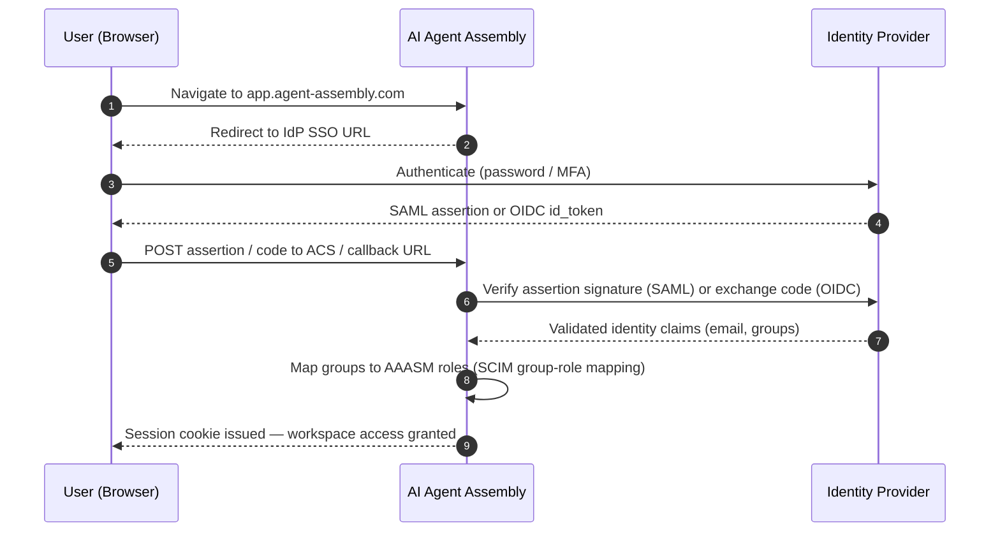

# Cloud Deployment

> 🚧 **Coming soon.** The AI Agent Assembly SaaS / commercial platform described here is planned and not yet generally available. The content below reflects the intended design.

This page covers how to configure an enterprise workspace on the AI Agent Assembly SaaS platform: identity federation (SSO), user provisioning (SCIM), regional data residency, budgets, SLAs, and billing.

> **This page covers the managed SaaS platform.** A limited-function stack is self-hostable from the Apache-2.0 crates (see the Docker Compose example) for local evaluation and development, but the enterprise operations described here — SSO, SCIM, regional data residency, SLAs, and billing — run only in the AI Agent Assembly cloud. See [Open core boundary](open-core-boundary.md) for the split.

---

## SaaS regions

AI Agent Assembly is available in the following regions. Data at rest and in transit stays within the selected region.

| Region | Location | Data residency |
|---|---|---|
| `us-east-1` | Northern Virginia, USA | United States |
| `eu-west-1` | Dublin, Ireland | European Union |
| `ap-northeast-1` | Tokyo, Japan | Asia-Pacific |

Select your primary region when creating a workspace (see [Quick Start (SaaS)](quickstart-saas.md)). Region selection is permanent — contact support to migrate.

---

## Tenant provisioning

A workspace is the top-level isolation boundary. All agents, policies, budgets, and users belong to a single workspace (tenant).

### Tenant creation

| Path | Who | How |
|---|---|---|
| Self-serve | Pro and Business | Sign up at `https://app.agent-assembly.com/signup`; workspace created immediately after email verification |
| SE-provisioned | Enterprise | Sales Engineer creates the workspace in the contracted dedicated region after contract signature |

### Tenant ID format

Tenant IDs (workspace IDs) follow the format `ws-<uuid4>` — for example, `ws-a1b2c3d4-e5f6-7890-abcd-ef1234567890`. The workspace ID is shown in **Settings → Workspace** and is required in all SDK configuration.

### Default quotas per tier

| Tier | Max agents | Max policies | Audit log retention |
|---|---|---|---|
| **Free** | 3 | 5 | 7 days |
| **Pro** | 10 | 20 | 30 days |
| **Business** | 50 | 100 | 90 days |
| **Enterprise** | Unlimited | Unlimited | Up to 1 year (configurable) |

Contact support to request a quota increase.

---

## SSO Configuration

The following diagram shows the SSO authentication flow for a user's first login after SSO is configured.

### SAML 2.0

1. In the AI Agent Assembly console, navigate to **Settings → Authentication → SSO**.
2. Select **SAML 2.0**.
3. Copy the **Assertion Consumer Service (ACS) URL** and **Entity ID** shown in the console.
4. In your IdP (Okta, Azure AD, PingFederate, etc.), create a new SAML application:
   - Set the **Single Sign-On URL** to the ACS URL.
   - Set the **Audience URI / SP Entity ID** to the Entity ID.
   - Map the following attributes:

| SAML Attribute | Description |
|---|---|
| `email` | User's email address (required) |
| `firstName` | User's given name |
| `lastName` | User's family name |
| `groups` | Group memberships for role mapping (optional) |

5. Download the **IdP metadata XML** from your IdP and upload it to the AI Agent Assembly console.
6. Click **Test SSO** to verify the configuration before enabling.
7. Enable **Enforce SSO** to prevent password-based login for your domain.

### OIDC

1. In the AI Agent Assembly console, navigate to **Settings → Authentication → SSO**.
2. Select **OpenID Connect (OIDC)**.
3. Register AI Agent Assembly as an OIDC client in your IdP:
   - Set the **Redirect URI** to the value shown in the console.
   - Request scopes: `openid email profile groups`.
4. Enter the following values from your IdP registration:
   - **Issuer URL** (e.g., `https://your-idp.example.com`)
   - **Client ID**
   - **Client Secret**
5. Save the configuration and click **Test OIDC Login**.

---

## SCIM User Provisioning

SCIM 2.0 enables automatic user and group provisioning from your IdP. When SCIM is configured, users are created, updated, and deprovisioned automatically as they are added to or removed from groups in your IdP.

### Supported operations

| SCIM operation | Supported |
|---|---|
| Create user | ✅ |
| Update user attributes | ✅ |
| Deactivate user | ✅ |
| Delete user | ✅ (deactivates; audit log records are retained) |
| Create group | ✅ |
| Update group membership | ✅ |
| Delete group | ✅ |

### Configuration steps

1. In the console, navigate to **Settings → Authentication → SCIM**.
2. Click **Generate SCIM Token**. Copy the token — it is shown only once.
3. In your IdP, configure the SCIM provisioning connector:
   - **SCIM Endpoint URL**: shown in the console (e.g., `https://api.agent-assembly.com/scim/v2`)
   - **Authentication Method**: Bearer Token
   - **Bearer Token**: the token generated in step 2
4. Enable provisioning in your IdP and run a test synchronization.
5. Verify users appear under **Settings → Users** in the console.

---

## Role-based access control

Workspace members are assigned one of the following roles:

| Role | Permissions |
|---|---|
| **Owner** | Full workspace administration: billing, SSO config, API keys, user management, all policy operations |
| **Admin** | Policy management, agent management, audit log access; cannot modify billing or SSO |
| **Developer** | Read agent topology and audit logs; manage own API keys; cannot create or modify policies |
| **Viewer** | Read-only access to agent topology, audit logs, and policy list |

Roles are assigned in the console under **Settings → Users**, or automatically via SCIM group-to-role mapping.

### SCIM group-to-role mapping

Configure group-to-role mappings in **Settings → Authentication → SCIM → Role Mapping**:

| IdP Group (example) | Mapped Role |
|---|---|
| `aaa-owners` | Owner |
| `aaa-admins` | Admin |
| `aaa-developers` | Developer |
| `aaa-viewers` | Viewer |

---

## Budget Configuration

Budgets cap per-team LLM spending. The gateway enforces the budget before allowing agent actions.

### Configuring a budget

1. Navigate to **Budgets → New Budget**.
2. Set the following fields:

| Field | Description |
|---|---|
| **Team name** | Name of the team (matches the `team` label on registered agents) |
| **Token limit** | Maximum tokens (input + output combined) per window |
| **Cost limit** | Maximum USD spend per window |
| **Window** | `hourly`, `daily`, `weekly`, or `monthly` |
| **Action on exceeded** | `deny` (block further calls, agent stays active) or `suspend` (suspend the agent entirely until the budget resets) |

3. Click **Save Budget**.

### Budget enforcement behaviour

- Budgets are evaluated **after** policy rules. A `deny` policy overrides a budget `allow`.
- When a budget is exceeded and action is `deny`, agents receive a `BudgetExceededError`.
- Budget state resets at the start of each window (midnight UTC for daily/weekly/monthly).
- Budget alerts are delivered to the configured notification channel (Slack, webhook).

---

## SLA tiers

| Tier | Availability SLA | Support response time | Notes |
|---|---|---|---|
| **Free** | Best effort | Community forum | For evaluation only |
| **Pro and Business** | 99.5% monthly uptime | 24h business hours | Up to 50 agents |
| **Enterprise** | 99.9% monthly uptime | 4h any time | Unlimited agents, dedicated SRE contact |

SLA credits apply for downtime exceeding the SLA threshold. See the Terms of Service for the full credit schedule.

---

## Billing setup

### Card-based billing (Pro and Business)

Pro and Business tiers are billed monthly via Stripe.

1. During workspace creation, enter your credit card on the **Billing** page.
2. Invoices are emailed to the workspace Owner's address on the first of each month.
3. Update your payment method any time under **Settings → Billing → Payment Method**.

### Invoice-based billing (Enterprise)

Enterprise customers are billed via net-30 invoice.

1. The Sales Engineer adds your purchase order number to the workspace at contract signature.
2. Invoices are issued monthly to the billing contact specified in the Order Form.
3. Wire transfer and ACH are accepted; credit card is not required.

### BAA and DPA (Enterprise)

> **HIPAA and GDPR compliance documents:** Enterprise customers requiring a **Business Associate Agreement (BAA)** for HIPAA compliance or a **Data Processing Agreement (DPA)** for GDPR compliance should request these documents during the SE call. Both are countersigned by the AI Agent Assembly legal team before workspace provisioning.

---

## Related documentation

- [Security model](security-model.md) — authentication flow diagrams, cryptographic primitives
- [Quick start (SaaS)](quickstart-saas.md) — initial workspace setup
- [Open core boundary](open-core-boundary.md) — which features are on which tier

---

*Last reviewed: 2026-06-11 · AI Agent Assembly Team*
