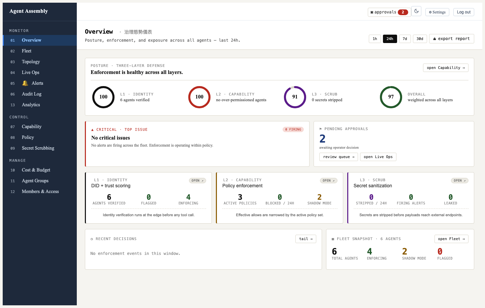
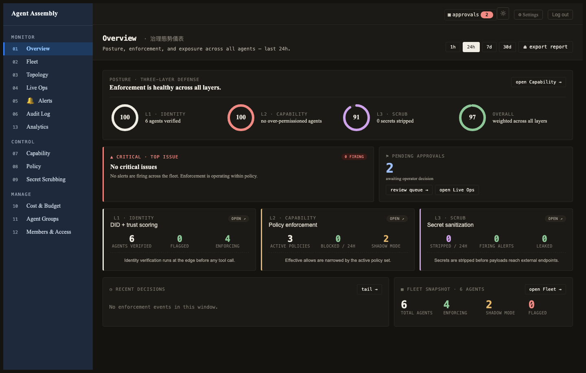
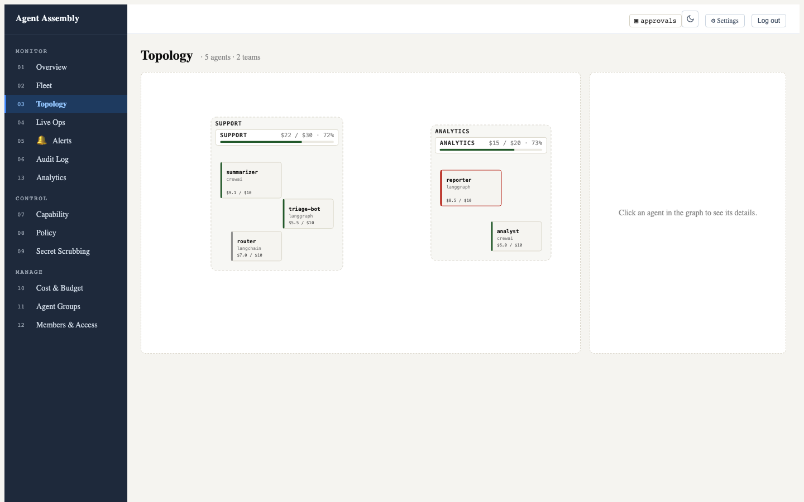
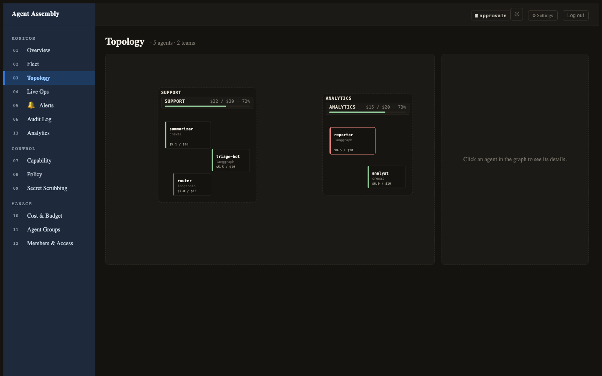

# Observe your agents in the Dashboard

This page is for **operators and developers who have wired up an agent** and want to
see the governance surface with their own eyes. It is the visual companion to the
golden-path *observe* step: once an agent is registered and events are flowing, the
**Dashboard** — the operator web UI shipped in the open-core stack — is where you
watch your fleet and read the immutable decision trail.

> **What these screenshots are.** They are the **real Dashboard UI**, captured from
> the dashboard's own front-end test harness with representative sample data (the same
> fixture-backed rendering the repo uses for its themed screenshot tests). They
> faithfully show the operator surface and its light/dark theming. They are **not** a
> claim about any particular deployment being wired end-to-end — they illustrate what
> the UI looks like, not a live environment. Your own numbers will differ.

Every screen is shown in both **light** and **dark** mode; the Dashboard follows your
saved preference (and your OS setting on first load).

---

## Overview — your agent, the moment it registers

The **Overview** (`/overview`) is the Dashboard's landing screen and the fastest way to
confirm a newly wired agent is live: the moment it registers, the **fleet snapshot** count
ticks up and the three-layer **posture rings** — identity, capability, scrub, and an overall
score — reflect it. It answers *"did my agent show up, and is the fleet healthy?"* at a
glance before you drill into Fleet or the Audit Log.

<figure>
  
  <figcaption>Operator dashboard — Overview, light mode. The fleet snapshot and posture rings update the moment an agent registers.</figcaption>
</figure>

<figure>
  
  <figcaption>Operator dashboard — Overview, dark mode.</figcaption>
</figure>

---

## Fleet — see every agent at a glance

The **Fleet** view (`/agents`) is the observe step's home base: every registered agent
across every framework, with its enforcement **mode** (enforce / shadow / off),
live **status**, owner, and when it was last seen. This is where you confirm an agent
you just registered actually showed up, and spot the ones in `error` or running in
`shadow`.

<figure>
  
  <figcaption>Operator dashboard — Fleet, light mode.</figcaption>
</figure>

<figure>
  
  <figcaption>Operator dashboard — Fleet, dark mode.</figcaption>
</figure>

---

## Topology — how agents cluster by team

The **Topology** view (`/topology`) lays the fleet out as a graph, grouping agents into
per-team clusters and drawing the delegation and call edges between them. Each cluster
carries its own budget bar, so you can see at a glance which team an agent belongs to
and how close that team is to its spend limit — the same fleet as the table above, read
as a map instead of a list.

<figure>
  
  <figcaption>Operator dashboard — Topology, light mode. Agents are grouped into per-team clusters, each with a budget bar.</figcaption>
</figure>

<figure>
  
  <figcaption>Operator dashboard — Topology, dark mode.</figcaption>
</figure>

---

## Audit Log — see a denial

The **Audit Log** (`/audit`) is the immutable governance trail: LLM calls, tool
invocations, file ops, network requests, policy verdicts, and approvals across all
agents. It is where the *"see a denial"* moment lands — the top row below is a
`DENY` on an outbound `gmail/send` to an external recipient, alongside the `allow`
and `redact` verdicts that make up normal traffic.

<figure>
  
  <figcaption>Operator dashboard — Audit Log, light mode. The top row is a denied external email send.</figcaption>
</figure>

<figure>
  
  <figcaption>Operator dashboard — Audit Log, dark mode.</figcaption>
</figure>

---

## Where to go next

- [Self-host observability](self-host-observability.md) — the health, readiness, and
  Prometheus metrics surface behind the UI, for wiring probes and scrape targets.
- [Open core boundary](open-core-boundary.md) — what the limited-function OSS stack
  (including this Dashboard) includes versus the managed SaaS feature set.
- [Security model](security-model.md) — the defense-in-depth posture the decisions in
  the Audit Log come from.

---

*Last reviewed: 2026-07-23 · AI Agent Assembly Team*
