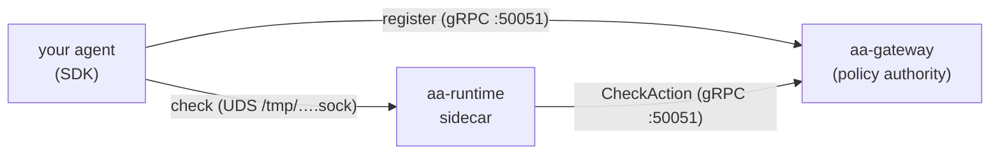

# Docker & Containers

This page is the reference for **running AI Agent Assembly from published container
images** — which images exist, how they are tagged, how to pull and run the
gateway and runtime, how to build your own agent image on top of the SDK base
images, and how to wire the governed agent + sidecar + gateway topology so it
works out of the box.

> **Scope: this covers the limited-function OSS self-host stack, not the managed
> SaaS.** The Apache-2.0 images below let you stand up the enforcement data plane
> locally for evaluation and development. **Full functionality — team budgets, the
> central registry, the operator dashboard, persistence, SSO/SCIM — remains
> SaaS-only.** See [Open core boundary](open-core-boundary.md) for the split and
> [Cloud Deployment](cloud-deployment.md) for the managed platform. This is not a
> production orchestration guide (no Helm / Terraform / Kubernetes).

---

## Published images

Five images are published to the GitHub Container Registry under
[`ghcr.io/ai-agent-assembly`](https://github.com/orgs/ai-agent-assembly/packages).
All are **multi-arch** (`linux/amd64` + `linux/arm64`) and carry **SLSA build
provenance** (see [Provenance & verification](#provenance--verification)).

| Image | Role |
|---|---|
| `ghcr.io/ai-agent-assembly/aa-gateway` | The policy/registry **brain**. Loads a policy file and serves the gRPC API on `:50051` — `AgentLifecycleService.Register` (agent registration) and `PolicyService.CheckAction` (the per-tool allow/deny decision). This is the policy *authority*. |
| `ghcr.io/ai-agent-assembly/aa-runtime` | The enforcement **sidecar**. Owns the SDK IPC socket at `/tmp/aa-runtime-<agent_id>.sock`, exposes health/metrics on `:8080`, and forwards each policy check to the gateway. |
| `ghcr.io/ai-agent-assembly/python` | **SDK base image** for building a Python agent — ships `python`, the `agent-assembly` SDK (native extension included), and the `aasm` CLI. |
| `ghcr.io/ai-agent-assembly/node` | **SDK base image** for building a Node/TypeScript agent — ships `node`, the globally installed `@agent-assembly/sdk`, and `aasm`. |
| `ghcr.io/ai-agent-assembly/go` | **SDK base image** for building a Go agent — ships the Go toolchain with the `go-sdk` pre-installed in the module cache, and `aasm`. |

> **Not published as images.** `aa-api` (the REST/OpenAPI surface) and `aa-proxy`
> (the egress-interception proxy) are Apache-2.0 crates in the
> [`agent-assembly`](https://github.com/ai-agent-assembly/agent-assembly)
> repository but have **no published container image** — do not expect to
> `docker pull` them. There is no separately runnable `aa-api` container: the
> REST surface (`/api/v1/health`) is only exposed when the gateway is launched
> in **local mode** (`--mode local`), a single-process dev topology **not** used
> by the gateway + runtime container stack on this page — that stack runs the
> gateway in its default **legacy gRPC mode**, which serves gRPC only on `:50051`
> and no HTTP (see [Self-Host Observability](self-host-observability.md)). To run
> `aa-proxy`, build it from source (`aa-proxy/Dockerfile`).

---

## Image tags

The two service images and the three SDK base images use **different** tag
schemes — the difference is deliberate and easy to get wrong.

**Service images (`aa-gateway`, `aa-runtime`)** are tagged with the release
version plus a moving `latest`:

```text
ghcr.io/ai-agent-assembly/aa-gateway:v0.0.1-rc.6   # immutable release tag
ghcr.io/ai-agent-assembly/aa-gateway:latest        # moves with each release
```

**SDK base images (`python`, `node`, `go`)** are tagged **`<runtime>-<version>`** —
the runtime version is part of the tag, so there is **no bare `:v0.0.1-rc.6`
tag** on these images. Each also publishes a moving, versionless `<runtime>` tag
and `latest`:

| Image | Pinned (release) tags | Moving tags |
|---|---|---|
| `python` | `3.12-slim-v0.0.1-rc.6`, `3.13-slim-v0.0.1-rc.6`, `3.14-slim-v0.0.1-rc.6` | `3.12-slim`, `3.13-slim`, `3.14-slim`, `latest` |
| `node` | `20-slim-v0.0.1-rc.6`, `22-slim-v0.0.1-rc.6`, `24-slim-v0.0.1-rc.6` | `20-slim`, `22-slim`, `24-slim`, `latest` |
| `go` | `1.24-alpine-v0.0.1-rc.6`, `1.25-alpine-v0.0.1-rc.6`, `1.26-alpine-v0.0.1-rc.6` | `1.24-alpine`, `1.25-alpine`, `1.26-alpine`, `latest` |

For reproducible builds, pin the release-tagged variant (or, better, a
`@sha256` digest — see [Provenance & verification](#provenance--verification)).
Use `latest` only for throwaway local demos.

---

## Pull and run the gateway and runtime

### Pull

```bash
docker pull ghcr.io/ai-agent-assembly/aa-gateway:v0.0.1-rc.6
docker pull ghcr.io/ai-agent-assembly/aa-runtime:v0.0.1-rc.6
```

Both images are public — no `docker login` is required to pull.

### Run the gateway

The gateway loads a policy file and serves gRPC. Mount your policy and publish
`:50051`:

```bash
docker run --rm \
  -v "$PWD/policy.yaml:/etc/aa/policy.yaml:ro" \
  -p 50051:50051 \
  ghcr.io/ai-agent-assembly/aa-gateway:v0.0.1-rc.6 \
  --policy /etc/aa/policy.yaml --listen 0.0.0.0:50051
```

| Aspect | Value |
|---|---|
| Args | `--policy <path>` (section-based policy file), `--listen <addr>` |
| Port | `50051` — gRPC (`Register` + `CheckAction`) |
| Volume | the policy file, mounted read-only |
| User | runs **non-root** (uid `65532`) — see [the topology below](#the-governed-topology) |

### Run the runtime

The runtime owns the SDK IPC socket (on a shared volume) and its health/metrics
server. Point it at the gateway with `AA_GATEWAY_ENDPOINT`:

```bash
docker run --rm \
  -e AA_AGENT_ID=my-agent-001 \
  -e AA_GATEWAY_ENDPOINT=http://gateway-host:50051 \
  -v aa-runtime-socket:/tmp \
  -p 8080:8080 \
  ghcr.io/ai-agent-assembly/aa-runtime:v0.0.1-rc.6
```

| Env var | Purpose |
|---|---|
| `AA_AGENT_ID` | Agent identity — determines the socket name `/tmp/aa-runtime-<AA_AGENT_ID>.sock`. **Must match the agent's `AA_AGENT_ID`.** |
| `AA_GATEWAY_ENDPOINT` | Gateway gRPC endpoint the runtime forwards `CheckAction` to. Leave unset to enforce locally from a mounted policy file (a coarse, action-type denylist — see the topology note). |
| `AA_METRICS_ADDR` | Bind address for the health/metrics server. Default `0.0.0.0:8080`. |

| Aspect | Value |
|---|---|
| Port | `8080` — HTTP `/health`, `/ready`, `/metrics` |
| Volume | a shared `/tmp` volume so the agent can reach the IPC socket |
| User | runs **non-root** (uid `65532`) |

### Health-checking

| Component | Probe | Endpoint |
|---|---|---|
| `aa-runtime` | liveness / readiness / metrics | `GET /health`, `GET /ready`, `GET /metrics` on `:8080` |
| `aa-gateway` | TCP liveness | TCP connect to the gRPC port `:50051` |

```bash
curl -fsS http://localhost:8080/ready       # runtime readiness -> "ready"
curl -fsS http://localhost:8080/health      # runtime liveness (JSON)
curl -fsS http://localhost:8080/metrics     # Prometheus scrape target
```

> **Probing the gateway.** As launched here (`--policy … --listen 0.0.0.0:50051`,
> no `--mode`), the gateway runs in **legacy gRPC mode**: it serves gRPC only on
> `:50051` and exposes **no HTTP health endpoint** — there is no `/healthz` to
> curl on this container. On top of that the image is **distroless** (no shell,
> no `curl`/`wget` inside), so a Compose `healthcheck: ["CMD-SHELL", …]` cannot
> run *inside* it either. Probe it **from the host with a TCP connect** to the
> gRPC port `:50051` instead. A standard gRPC `grpc.health.v1.Health` service on
> `:50051` is being added (AAASM-4759); until it ships, a TCP-level check of
> `:50051` is the gateway liveness signal.

See [Self-Host Observability](self-host-observability.md) for the full health,
readiness, and Prometheus-metrics surface, including the baseline metric set.

### Compose

The minimal runtime-sidecar stack as a Compose snippet:

```yaml
services:
  aa-runtime:
    image: ghcr.io/ai-agent-assembly/aa-runtime:v0.0.1-rc.6
    environment:
      AA_AGENT_ID: "my-agent-001"
      AA_POLICY_PATH: "/etc/aa/policy.toml"   # local enforcement, no gateway
    volumes:
      - aa-runtime-socket:/tmp                # socket lives at /tmp/aa-runtime-my-agent-001.sock
      - ./policy.toml:/etc/aa/policy.toml:ro
    ports:
      - "8080:8080"                           # health + metrics

volumes:
  aa-runtime-socket:
```

A complete, runnable version — plus the optional `aa-proxy` egress profile — is
maintained in the `examples` repository at
[`scenarios/live-core-enforcement/`](https://github.com/ai-agent-assembly/examples/tree/main/scenarios/live-core-enforcement).

---

## Build your own agent image

The `python`, `node`, and `go` images are **base images**: the language runtime
with the Agent Assembly SDK (and the `aasm` CLI) already installed. Build your
agent by adding *only* your source on top — no SDK install step needed.

```dockerfile
# Python agent on the SDK base image.
FROM ghcr.io/ai-agent-assembly/python:3.13-slim-v0.0.1-rc.6

WORKDIR /agent
COPY agent.py /agent/agent.py

# The base image already provides `python`, the `agent_assembly` SDK
# (native extension included), and the `aasm` binary — so no `pip install`.
CMD ["python", "/agent/agent.py"]
```

The Node and Go base images work the same way — swap the `FROM` line for
`ghcr.io/ai-agent-assembly/node:22-slim-v0.0.1-rc.6` (a bare `require('@agent-assembly/sdk')`
resolves via the base image's `NODE_PATH`) or
`ghcr.io/ai-agent-assembly/go:1.26-alpine-v0.0.1-rc.6` (the `go-sdk` is already in
the module cache). Reference Dockerfiles for all three languages live in the
`agent-assembly` repository under
[`docker/smoke/agents/`](https://github.com/ai-agent-assembly/agent-assembly/tree/main/docker/smoke/agents).

---

## The governed topology

For **per-tool** allow/deny enforcement, run the full three-piece topology: your
agent, the `aa-runtime` sidecar, and the `aa-gateway`. The runtime's own local
policy is a coarse *action-type* denylist; only the gateway's section-based
policy engine can distinguish, say, `read_file` (allow) from `delete_file`
(deny).



Two distinct transports are in play: **registration** is a *direct* SDK → gateway
gRPC call (the native client reads `AA_GATEWAY_ENDPOINT`, which defaults to
`127.0.0.1:50051` — wrong inside a container, so set it explicitly); the
**governed check** goes over the runtime's Unix domain socket, and the runtime
forwards `CheckAction` to the gateway.

### The uid requirement

The runtime creates its IPC socket **owner-only (`0600`)** — there is no
group/world access window (a tightened `umask` guarantees `0600` from the first
instant, closing a TOCTOU gap). Both `aa-runtime` and `aa-gateway` run as the
distroless **non-root user, uid `65532`**. Because the socket is `0600`, **the
agent process must run as the same uid (`65532`) as the runtime** — otherwise it
cannot open the socket and every governed call fails to connect. Aligning the
uid is what makes the stack work out of the box:

```yaml
services:
  aa-gateway:
    image: ghcr.io/ai-agent-assembly/aa-gateway:v0.0.1-rc.6
    command: ["--policy", "/etc/aa/policy.yaml", "--listen", "0.0.0.0:50051"]
    volumes:
      - ./policy.yaml:/etc/aa/policy.yaml:ro
    ports:
      - "50051:50051"

  aa-runtime:
    image: ghcr.io/ai-agent-assembly/aa-runtime:v0.0.1-rc.6
    depends_on: [aa-gateway]
    environment:
      AA_AGENT_ID: "my-agent-001"
      AA_GATEWAY_ENDPOINT: "http://aa-gateway:50051"
    volumes:
      - aa-runtime-socket:/tmp
    ports:
      - "8080:8080"

  agent:
    build: ./agent
    # Align the agent's uid with the runtime's (distroless nonroot = 65532)
    # so it can open the 0600 runtime socket. Without this the governed
    # calls cannot connect.
    user: "65532:65532"
    depends_on: [aa-gateway, aa-runtime]
    environment:
      AA_AGENT_ID: "my-agent-001"                     # MUST match aa-runtime
      AA_RUNTIME_SOCKET: "/tmp/aa-runtime-my-agent-001.sock"
      AA_GATEWAY_ENDPOINT: "http://aa-gateway:50051"  # native client (registration)
      AA_GATEWAY_URL: "http://aa-gateway:7391"        # SDK gateway handle (REST control plane)
    volumes:
      - aa-runtime-socket:/tmp                          # same socket the runtime created

volumes:
  aa-runtime-socket:
```

> **Distroless images have no in-container healthcheck.** Because `aa-runtime`
> and `aa-gateway` ship no shell, gate readiness **from the host** (poll the
> runtime's `:8080/ready` and the gateway's `:50051`) rather than with a Compose
> `CMD-SHELL` healthcheck — an in-container probe fails with `exec: "/bin/sh":
> no such file or directory` and leaves `depends_on: condition: service_healthy`
> stuck.

### Fail-closed behavior

The governed path is **fail-closed**. Under `enforcement_mode="enforce"` a
gateway `deny` blocks the tool call before it runs. Critically, an *unreachable*
dependency is treated as a deny, **not** as an allow: if the agent cannot reach
its runtime sidecar — or the runtime cannot reach the gateway — the SDK denies
the action rather than letting it execute ungoverned. This is why the uid
alignment and endpoint wiring above matter: a mis-wired socket or gateway
endpoint surfaces as blocked calls, not as silent bypass.

> Where a specific SDK's fail-closed-on-unreachable default is still being
> finalized, that is tracked under AAASM-4766 / AAASM-4760; the enforcement
> *contract* documented here is the intended behavior of the governed topology.

A complete, genuine end-to-end version of this topology — real SDK, real
runtime, real gateway, a policy that actually blocks a `delete_file` call — is
maintained in the `examples` repository at
[`scenarios/live-core-enforcement/`](https://github.com/ai-agent-assembly/examples/tree/main/scenarios/live-core-enforcement).

---

## Provenance & verification

Every published image is built multi-arch with **SLSA build provenance**
attached as an in-toto attestation, so you can verify *how* and *from where* an
image was built before you run it.

**Inspect the provenance** of an image (and its multi-arch manifest) with
BuildKit's imagetools:

```bash
docker buildx imagetools inspect \
  ghcr.io/ai-agent-assembly/aa-gateway:v0.0.1-rc.6 \
  --format '{{ json .Provenance }}'
```

**Pin by immutable digest.** Tags (even release tags) are convenient but a
digest is content-addressed and cannot be moved. Resolve the current digest:

```bash
docker buildx imagetools inspect ghcr.io/ai-agent-assembly/aa-gateway:v0.0.1-rc.6
# Name: ghcr.io/ai-agent-assembly/aa-gateway:v0.0.1-rc.6
# Digest: sha256:9754356e4d9b6062b0bc3b40fde62c196112636ee11650fb6e4cee91ae428954
```

…then pin it in your `docker run` / Compose / Dockerfile:

```text
ghcr.io/ai-agent-assembly/aa-gateway@sha256:9754356e4d9b6062b0bc3b40fde62c196112636ee11650fb6e4cee91ae428954
ghcr.io/ai-agent-assembly/aa-runtime@sha256:5b604612b80f14a1763cc50d126a31ee05454af874bd8a4c3d3cf6fe6c444b74
```

(The digests above are the `v0.0.1-rc.6` manifests at the time of writing —
always re-resolve for the version you intend to run.)

**Non-root posture.** The `aa-gateway` and `aa-runtime` images are built on
`gcr.io/distroless/static:nonroot` — they contain only the statically linked
binary (no shell, no package manager) and run as uid `65532` by default,
minimizing attack surface.

> **SBOM and image signatures are a tracked follow-up (AAASM-4762).** Once
> published, this section will document verifying the SBOM attestation and the
> image signature; until then, provenance inspection and digest pinning above
> are the available verification steps.

---

## Support boundary

The container images on this page stand up the **limited-function OSS
self-host** stack — the enforcement data plane (runtime + gateway + optionally
`aa-proxy`, built from source) — for local evaluation and development. You are
responsible for operating and monitoring what you self-host.

**Full functionality is SaaS-only**: team budgets, the central agent registry,
the operator dashboard, persistence, identity federation (SSO/SCIM), regional
data residency, tamper-evident audit, and the uptime SLAs run only in the
managed [AI Agent Assembly cloud](cloud-deployment.md). See
[Open core boundary](open-core-boundary.md) for the precise line between what
you can self-host and what the SaaS adds.

---

## Related documentation

- [Self-Host Observability](self-host-observability.md) — health, readiness, and Prometheus metrics for the images above.
- [Open core boundary](open-core-boundary.md) — OSS vs SaaS feature split and crate licensing.
- [Cloud Deployment](cloud-deployment.md) — the managed SaaS platform.
- [Security model](security-model.md) — the three-layer interception model and defense-in-depth posture.
- [Troubleshooting](troubleshooting.md) — common issues when running the stack.

---

*Last reviewed: 2026-07-18 · AI Agent Assembly Team*
