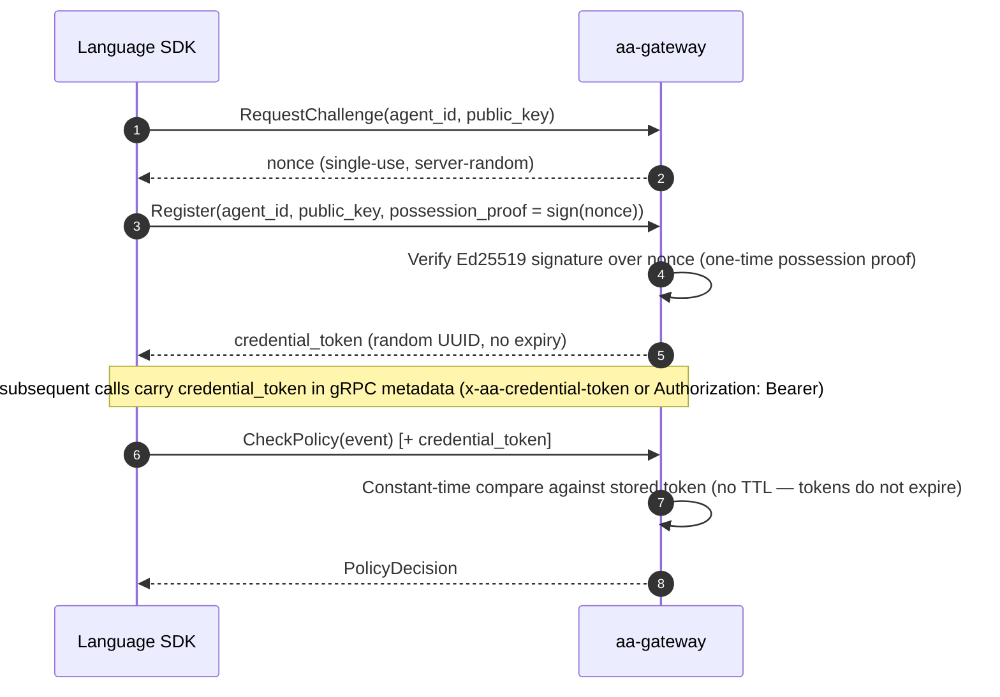
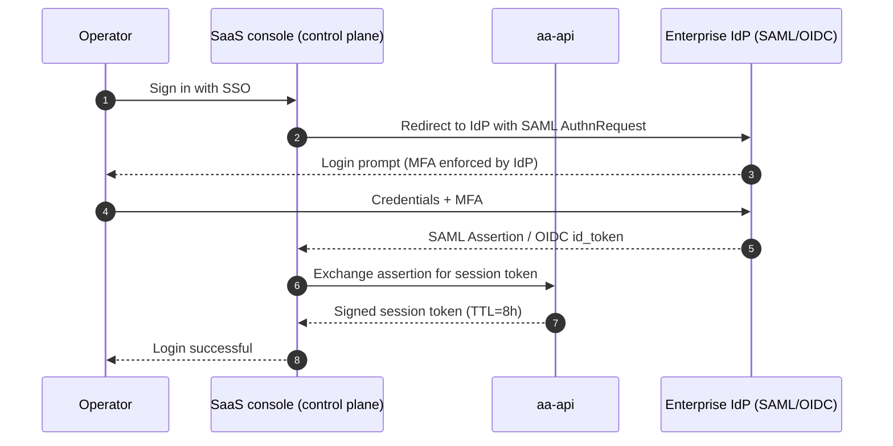

# Security model

AI Agent Assembly is a **governance layer for AI agents** — it enforces policy, tracks cost, and intercepts unsafe actions before they run. This page documents the security posture behind that enforcement, for enterprise security and compliance teams. It covers the layered defense model, a STRIDE threat analysis, the cryptography in use, and the audit and compliance posture.

---

## IronClaw five-layer defense

AI Agent Assembly groups its security controls into five named layers. Each layer is independently deployable and adds defense-in-depth — if one layer is bypassed, the next still applies.

| Layer | Name | What it does |
|---|---|---|
| 1 | **Boundary** | Network perimeter: sidecar proxy (`aa-proxy`) enforces egress policy; eBPF sensor (`aa-ebpf`) catches kernel-level bypass attempts |
| 2 | **Identity** | Agent and user authentication: the gRPC agent plane is authenticated by a random per-agent credential token (UUID, constant-time compare, no expiry) minted after a one-time Ed25519 possession-proof at registration; operator authentication via SAML 2.0 / OIDC SSO. A separate HMAC-SHA256 JWT (24h TTL) protects the REST/admin surface only, and that surface's auth is **off by default** — see the callout in [Authentication flow](#authentication-flow) below |
| 3 | **Policy** | Runtime governance: YAML/JSON policy rules evaluated by the gateway policy engine before every agent action |
| 4 | **Vault** | Secret and credential management: AES-256-GCM encryption at rest for stored secrets; Ed25519-signed tokens for inter-component trust |
| 5 | **Telemetry** | Audit and observability: append-only event log for every agent action; Slack/webhook connectors for real-time alerting on policy violations |

> **How the five layers relate to the three interception points.** The five *defense-in-depth layers* above (Boundary, Identity, Policy, Vault, Telemetry) describe *what* is protected. The three *interception points* named on the landing page and marketing site — the SDK layer, the sidecar proxy (`aa-proxy`), and the eBPF sensor (`aa-ebpf`) — describe *where* enforcement is applied, and all three sit inside the **Boundary** layer. They are two views of one system, not two competing models.

---

## STRIDE threat model

The table below maps each STRIDE category to the five primary components of AI Agent Assembly and the control that mitigates it.

| Component | **S**poofing | **T**ampering | **R**epudiation | **I**nfo Disclosure | **D**enial of Service | **E**levation of Privilege |
|---|---|---|---|---|---|---|
| **Language SDK** | One-time Ed25519 possession-proof at registration, then a random per-agent credential token (constant-time compare) on every call | SDK integrity verified by Cargo/npm/PyPI package hash | Every call logged with agent ID and timestamp | gRPC transport is plaintext by default — the app-layer credential-token interceptor authenticates every call; mTLS is an optional, unwired hardening layer; secrets never logged | Rate limiting enforced by gateway budget tracker | Policy engine enforces agent scope; no ambient privilege |
| **Gateway (aa-gateway)** | Credential-token interceptor validates every agent-plane gRPC call (fail-closed on approval/audit/topology/secrets); REST/admin surface can opt into JWT validation, off by default | Input validation on all RPCs; schema-enforced policy rules | Append-only audit log with tamper-evident signatures | Internal-only gRPC endpoint; never exposed directly | Per-team budget caps block runaway agent spending | RBAC on all administrative API endpoints |
| **Sidecar Proxy (aa-proxy)** | Per-host CA pinning prevents MitM spoofing by agents | TLS termination with certificate validation on every upstream | All intercepted requests logged by proxy before forwarding | Proxy does not log request/response bodies by default | Connection pool limits per agent; circuit breaker on upstream failure | Proxy runs as unprivileged user; no write access to host filesystem |
| **eBPF Sensor (aa-ebpf)** | eBPF program loaded only by privileged system service | BPF verifier rejects unsafe programs at load time | Kernel event timestamps are monotonic; cannot be retroactively altered | eBPF only reads SSL buffers; no access to unrelated memory regions | eBPF programs have bounded execution; verifier enforces loop limits | Loaded via CAP_BPF only; capability is dropped after program load |
| **REST API (aa-api)** | SAML/OIDC token validation on every request | OpenAPI schema validation rejects malformed inputs | All mutating API calls logged with actor identity | HTTPS-only; HSTS enforced; no sensitive data in query strings | Rate limiting per IP and per tenant; DDoS mitigation via upstream load balancer | Tenant isolation enforced at API layer; cross-tenant access rejected |

> **Traceability**: Each STRIDE row maps to a specific IronClaw layer control. For configuration paths and runbook references, consult the security runbook in the `agent-assembly` repository.

---

## Cryptographic primitives

| Primitive | Algorithm | Key length | Usage | Rotation cadence (NIST SP 800-57) |
|---|---|---|---|---|
| Agent registration proof | Ed25519 | 256-bit | One-time possession-proof signature over a server-issued nonce, verified at `RegisterAgent`; not a reusable bearer credential | Agent-supplied keypair; not gateway-managed |
| Agent credential token | UUID v4 (CSPRNG) | 122-bit random | Bearer credential presented on every agent-plane gRPC call after registration; validated with a constant-time compare | No expiry — replaced only on re-registration |
| REST/admin session token | JWT (HMAC-SHA256) | 256-bit | Authenticates REST/admin API callers; only issued when gateway auth is explicitly enabled (off by default) | 24h token TTL |
| Vault encryption | AES-256-GCM | 256-bit | Encrypts secrets and credentials at rest | Every 1 year or on compromise |
| Callback / webhook signature | HMAC-SHA256 | 256-bit | Signs outbound webhook payloads so receivers can verify authenticity | Every 90 days or on rotation of webhook secret |
| TLS (transport) | TLS 1.3 | ECDHE-256 | Operator/external HTTPS traffic; the gRPC agent-plane transport is plaintext by default (see the callout below) | Certificate: every 90 days (auto-renewed) |

All keys are generated using a CSPRNG. No MD5, SHA-1, or DES primitives are used anywhere in the stack.

---

## Authentication flow

### SDK to gateway (gRPC)

### Operator to console (SAML/OIDC)

Operators sign in through the SaaS console (control plane) — SSO is a hosted
control-plane flow, not an `aasm` CLI command.

---

## Secrets management

- Secrets (LLM API keys, webhook tokens) are stored encrypted with AES-256-GCM.
- The encryption key is derived from a master secret held in the SaaS control plane's hardware security module (HSM).
- Secrets are never written to disk in plaintext.
- Secrets are never logged, even at `DEBUG` level.
- Secret rotation is performed from the SaaS console (control plane), which re-encrypts in place without a service restart.

---

## Audit log

- Every agent action (policy check, event record, budget debit) produces an immutable log entry.
- Log entries are signed with HMAC-SHA256 using a log-signing key.
- Logs are append-only; no delete or update API exists.
- Log retention: configurable per tenant (default: 90 days).
- Logs are exportable in JSON or CEF format for SIEM integration.

---

## Compliance posture

| Standard | Status |
|---|---|
| SOC 2 Type II | In preparation (target: Q3 2026) |
| ISO 27001 | Roadmap (post-SOC 2) |
| GDPR | Architecture is GDPR-compatible; DPA available on request |
| CCPA | Covered under SaaS Data Processing Agreement |

---

## Related documentation

- [Why AI Agent Assembly?](comparison.md) — competitive positioning and governance differentiation
- [Cloud deployment](cloud-deployment.md) — SSO configuration, SCIM provisioning
- [Open core boundary](open-core-boundary.md) — which security features are OSS vs. enterprise

  Evaluating for production?
  <a href="https://agent-assembly.com/early-access?utm_source=docs&amp;utm_medium=docs_link&amp;utm_campaign=early_access&amp;utm_content=security_model_page" data-cta-location="body" rel="noopener">Request Cloud Early Access →</a>
  
Talk to the team about the STRIDE model, tamper-evident audit, and your
     compliance path. Cloud is in early access / design-partner today.

---

*Last reviewed: 2026-06-11 — AI Agent Assembly Team*
