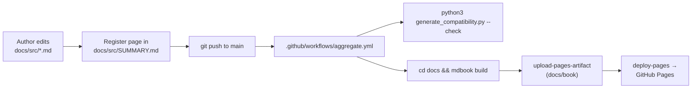

# Documentation sync architecture

How documentation reaches the AI Agent Assembly documentation hub, end to end.

This is a **contributor-facing meta-document** — it describes how the repo's build
and (planned) sync pipeline work. It deliberately lives at `docs/sync-architecture.md`,
**outside** [`docs/src/`](src/), so it is part of the repo's contributor docs and is
**not** rendered into the published mdBook site.

> **Status:** the hub is **manually authored** today. The automated cross-repo sync
> described in [Planned: automated cross-repo sync](#planned-automated-cross-repo-sync-aaasm-302)
> is **designed but not yet built** (tracked as **AAASM-302**). Everything in that
> section is the intended design, not current behaviour.

## Current flow: manual mdBook → GitHub Pages

Today there is no cross-repo content sync. Every published page is hand-written in
this repo and shipped by a single build-and-deploy workflow.



Step by step:

1. A contributor edits or adds a Markdown file under [`docs/src/`](src/) and registers
   it in [`docs/src/SUMMARY.md`](src/SUMMARY.md).
2. On push to `main` (or on a PR), [`aggregate.yml`](../.github/workflows/aggregate.yml)
   runs. It installs mdBook `v0.4.40`, verifies the compatibility matrix is in sync
   with [`compatibility.toml`](../compatibility.toml), and runs `mdbook build`.
3. The `build` job uploads `docs/book/` as a Pages artifact. On `main`, the `deploy`
   job publishes it to GitHub Pages.
4. The site goes live at
   <https://docs.agent-assembly.com/>.

The hub stays evergreen for the **component** docs (core + the three SDKs) by
**linking** to each component's own published docs site root rather than copying
their content — see the router page, [`docs/src/documentation.md`](src/documentation.md).
So "sync" today means "a human links to the right place," not an automated copy.

There are two generated/derived pieces in this flow, neither of which is a
cross-repo sync:

- **Compatibility matrix** — `docs/scripts/generate_compatibility.py` renders
  [`compatibility.toml`](../compatibility.toml) into the marked block of
  [`docs/src/compatibility.md`](src/compatibility.md). CI fails on drift.
- **"Last updated" footer** — the `last-changed.py` mdBook preprocessor appends each
  page's last-commit date at build time from git history.

## Planned: automated cross-repo sync (AAASM-302)

> **Not built yet.** The design below comes from **AAASM-302**. None of the files it
> references (`.github/workflows/sync-docs.yml`, `scripts/sync-docs.sh`,
> `docs-manifest.json`) exist on `main` today. This section documents the intended
> pipeline so contributors understand where it is headed and how to extend it once
> it lands.

The goal is to let each SDK repo push its own released docs into this hub
automatically, so the hub can host versioned per-component documentation without a
human copying files.

### Trigger and payload

Each source repo (core + SDKs) fires a [`repository_dispatch`](https://docs.github.com/en/actions/using-workflows/events-that-trigger-workflows#repository_dispatch)
event at this repo on release, from its own CI:

```sh
gh api repos/ai-agent-assembly/docs/dispatches \
  -f event_type=docs-release \
  -f client_payload[repo]=python-sdk \
  -f client_payload[tag]=v0.3.0
```

The event:

- **`event_type`**: `docs-release`
- **`client_payload`**: `{ "repo": "<source-repo-name>", "tag": "<release-tag>" }`

### End-to-end pipeline

```mermaid
flowchart LR
    R["Source repo CI<br/>(on release)"] -->|"repository_dispatch<br/>event_type: docs-release<br/>{repo, tag}"| W[".github/workflows/<br/>sync-docs.yml"]
    W --> S["scripts/sync-docs.sh"]
    S --> C1["checkout source repo<br/>at tag"]
    C1 --> C2["copy its docs/ into<br/>docs/&lt;repo-name&gt;/"]
    C2 --> C3["update docs-manifest.json<br/>(last synced tag per repo)"]
    C3 --> V["validate:<br/>markdownlint + lychee"]
    V --> P["commit + push to main"]
    P --> B["aggregate.yml<br/>mdbook build + Pages deploy"]
```



1. A `docs-release` dispatch arrives. `sync-docs.yml` reads `repo` and `tag` from the
   payload.
2. `scripts/sync-docs.sh` checks out the releasing repo **at `tag`** and copies its
   `docs/` content into `docs/<repo-name>/` in this hub.
3. The script records the synced tag in `docs-manifest.json` (see format below).
4. CI validates the synced content (`markdownlint` on the Markdown, `lychee` on the
   built HTML), then commits and pushes to `main`.
5. The push to `main` triggers the existing [`aggregate.yml`](../.github/workflows/aggregate.yml),
   which rebuilds and redeploys the site.

**Idempotency:** re-running the same `repo` + `tag` must produce byte-identical
output — the manifest entry already records that tag, the copy is deterministic, and
a no-op sync should yield an empty diff (no new commit).

### `docs-manifest.json` format

The manifest is committed to source control so the sync history is auditable — one
entry per source repo recording the last tag synced into the hub. Planned shape:

```json
{
  "version": 1,
  "repos": {
    "python-sdk": {
      "last_synced_tag": "v0.3.0",
      "synced_at": "2026-06-15T00:00:00Z",
      "target_path": "docs/python-sdk/"
    },
    "node-sdk": {
      "last_synced_tag": "v0.2.1",
      "synced_at": "2026-06-10T00:00:00Z",
      "target_path": "docs/node-sdk/"
    }
  }
}
```

- **`version`** — manifest schema version, bumped only on a breaking schema change.
- **`repos.<name>`** — keyed by source repo name (matches the dispatch `repo` field).
  - **`last_synced_tag`** — the most recent release tag pulled in; the sync compares
    against this to stay idempotent.
  - **`synced_at`** — UTC timestamp of the last successful sync.
  - **`target_path`** — where the repo's docs land in the hub (`docs/<repo-name>/`).

> The exact schema is finalized under AAASM-302 (subtask AAASM-538, "Define
> docs-manifest.json schema and seed file"). Treat the shape above as the proposed
> design.

### Adding a new repo to the sync pipeline

Once the pipeline exists, onboarding a new source repo is two-sided:

1. **In this hub** — add a `repos.<new-repo>` entry to `docs-manifest.json` (with the
   `target_path` it should sync into), and ensure `scripts/sync-docs.sh` recognizes
   the new `repo` value. If the synced subtree should appear in the published nav,
   add it to [`docs/src/SUMMARY.md`](src/SUMMARY.md).
2. **In the source repo** — add a release-time CI step that fires the
   `repository_dispatch` event (the `gh api … dispatches` call above) with
   `client_payload.repo` set to the new repo's name and `client_payload.tag` set to
   the released tag.

After both sides are wired, the next release of the source repo will sync its docs
into the hub automatically and the manifest will start tracking its tags.

## See also

- [`README.md`](../README.md) — what this repo is, prerequisites, the live site URL.
- [`CONTRIBUTING.md`](../CONTRIBUTING.md) — how to add/edit pages, validate, and open a PR.
- [`.github/workflows/aggregate.yml`](../.github/workflows/aggregate.yml) — the current
  build + Pages deploy workflow.
